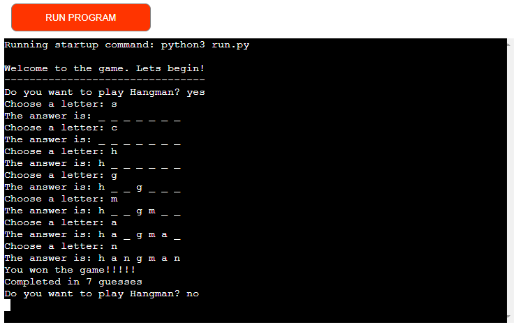
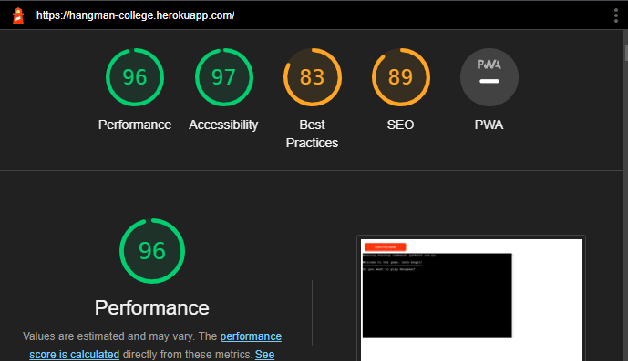

# About

Find a link to the final deployed version here *[Hangman](https://hangman-college.herokuapp.com/)*.

python-hangman is a back-end CLI hangman game. Created using python classes, and object orientated programming principles within class design.

# Features

The computer generates a random word from a pre written list. The game lets users input guesses as letters to the terminal. The computer can check these guesses against its randomly chosen word to see if the guessed letter is the same. If the letter is the same it appears in the space on the display of the hidden word. After the word is guessed correctly, the word is tested to see if it matches the full hidden word. If so the player wins and is told how many guesses it took them to complete the word.

## Future features

- The ability to have a limited number of guesses before losing the game.

# Testing

I have thoroughly examined this application for any errors that may arise when trying to use any of the functions. I have found that everything works as intended and the deployed game can be played without issue. I sent the link to a couple of my friends via email link and they all reported to have no issues playing through the game

## Automated Testing

I ran the dev tools lighthouse testing and achieved a high scores for Performance, Accessibility and Best Practices

## Validation

Pep8 online was not working when i tried to validate my python code.  
I used the VSCode validator and have cleaned up any errors i came across along my way. Its passing with no significant issues.

## Technologies used

- Python
- Heroku

## Reminders

* Your code must be placed in the `run.py` file
* Your dependencies must be placed in the `requirements.txt` file
* Do not edit any of the other files or your code may not deploy properly

## Deployment

### Creating the Heroku app

When you create the app, you will need to add two buildpacks from the _Settings_ tab. The ordering is as follows:

1. `heroku/python`
2. `heroku/nodejs`

You must then create a _Config Var_ called `PORT`. Set this to `8000`

Connect your GitHub repository and deploy as normal.
